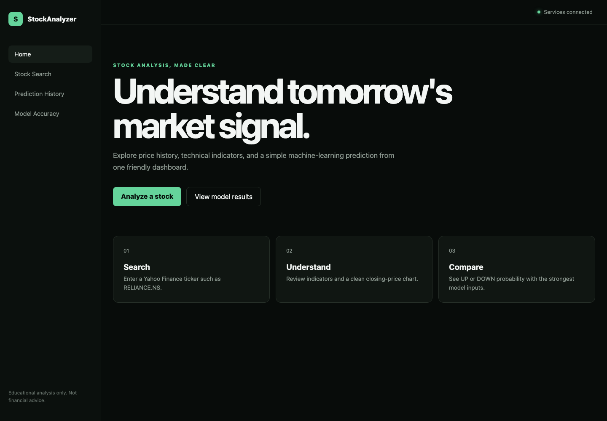
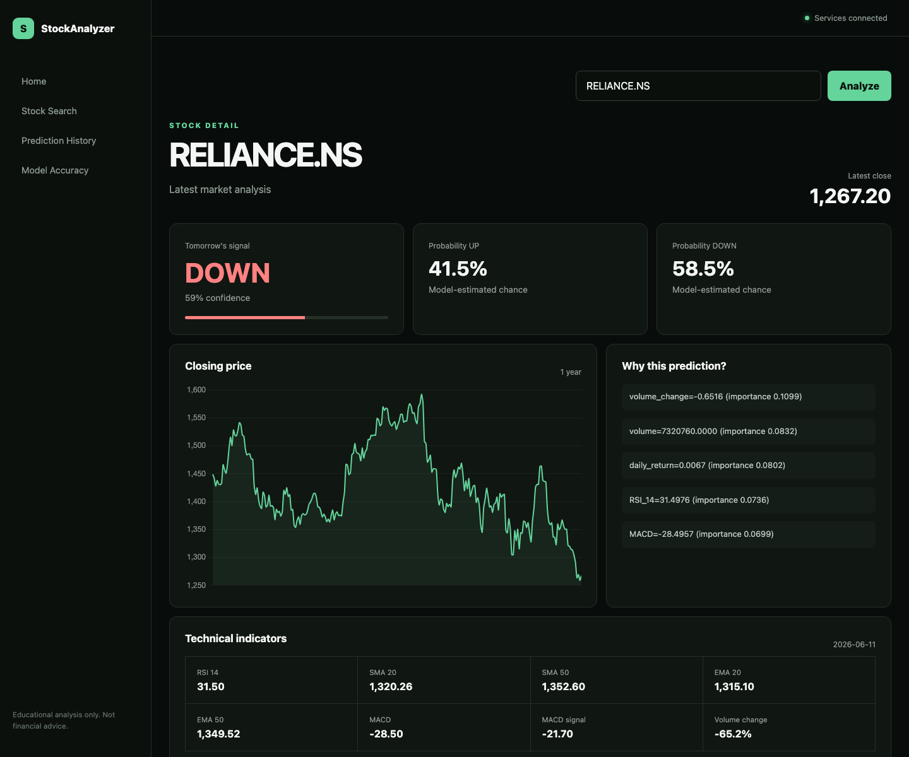

# StockAnalyzer

StockAnalyzer is an educational full-stack stock-analysis dashboard. Enter any
valid Yahoo Finance ticker to explore historical prices and technical indicators
and estimate whether the next trading-day close may be **UP** or **DOWN**.

Each ticker receives its own Random Forest model. If no model exists,
StockAnalyzer creates a leakage-safe dataset, trains the model, registers its
metrics, and returns the prediction in the same request. If training is not
possible, the application returns a clearly labeled rule-based fallback.

> **Disclaimer:** StockAnalyzer is for educational purposes only. It is not
> financial advice, a trading recommendation, or a promise of future results.

## Screenshots

Add or replace screenshots under `docs/screenshots/` as the interface evolves.

### Dashboard



### Stock analysis



Suggested additional captures:

- Model Accuracy page with ticker-specific metrics
- Background model retraining with durable job status and immutable versions
- Guest watchlist with batch delayed quotes, notes, tags, daily change, range, and sparklines
- Learning Center with RSI, MACD, EMA, SMA, volume, and risk foundations
- Contextual indicator lessons, knowledge checks, glossary, and guest progress
- Browser-local price and daily-move alerts with an in-app notification center
- Anonymous PostgreSQL workspace sync for watchlists, alert rules, and notifications
- First-time model training progress
- Rule-Based Fallback badge and warning

## Features

- Angular dashboard with loading, validation, retry, and error states
- Research-first stock brief with quote, directional estimate, visible risk, and supporting/conflicting evidence
- Two-to-three stock comparison with normalized cross-currency performance
- India and US market overview with major indices and transparent sampled movers/breadth
- Source-linked stock news with deterministic sentiment, topic, impact, coverage, and catalyst context
- Manual portfolio tracking with cost basis, delayed valuation, gain/loss, daily movement, allocation, and concentration flags
- Debounced ticker and company autocomplete with keyboard navigation
- Historical OHLCV data and Chart.js closing-price chart
- SMA, EMA, RSI, MACD, Bollinger Bands, returns, and volume indicators
- Rule-based and Random Forest UP/DOWN predictions
- Dynamic Yahoo Finance ticker support with one saved ML model per ticker
- Automatic first-time training and manual **Retrain Model** workflow
- Ticker-specific accuracy, precision, recall, confusion matrix, and row counts
- Rule-based fallback for invalid, incomplete, or insufficient market data
- Optional grounded OpenAI research explanation with strict structured output
- Ticker-scoped AI Research Assistant with timestamped evidence citations and safe suggested questions
- Automatic deterministic explanation fallback when OpenAI is disabled or unavailable
- Prediction outcome evaluation and accuracy tracking
- PostgreSQL-backed prediction accountability history with filters, outcome review, and CSV export
- PostgreSQL persistence through Entity Framework Core migrations
- Structured request logs with correlation IDs
- Swagger/OpenAPI documentation for .NET and FastAPI
- Angular, .NET, and Python unit tests with GitHub Actions CI

## Business Direction

StockAnalyzer is intended to monetize as an educational research SaaS, not as a
stock-tip or personalized-advice product. The first commercial roadmap focuses
on freemium usage limits, paid research workflow features, affiliate disclosure,
learning products, and later creator/B2B tooling.

See [docs/15_Business_Monetization_Roadmap.md](docs/15_Business_Monetization_Roadmap.md).

## Architecture

| Service | Technology | Host URL |
| --- | --- | --- |
| `angular-frontend` | Angular 20, Nginx, Chart.js | `http://localhost:4200` |
| `dotnet-backend` | .NET 9 Web API, EF Core | `http://localhost:8080` |
| `python-ml-service` | FastAPI, pandas, scikit-learn | `http://localhost:8000` |
| `postgres` | PostgreSQL 17 | `localhost:5433` |

The browser calls the .NET API. The .NET API calls FastAPI and stores stocks,
prices, predictions, outcomes, model metrics, and AI explanation metadata in PostgreSQL.
Only FastAPI can call OpenAI; the API key is never passed to Angular or returned by .NET.

Market data is accessed through a provider interface in the ML service. The
default adapter uses Yahoo Finance, while the application and API contracts are
kept provider-neutral so a licensed feed can replace it without rewriting the
analysis, model, backend, or frontend layers.

News uses the same provider boundary. The current implementation reads Yahoo
Finance headlines, deduplicates them, and applies transparent deterministic
keyword rules for sentiment, topic, and potential impact. It does not use an
LLM. A licensed provider or source-grounded LLM summarizer can replace this
adapter later while preserving the public API contract and UI.

## Quick Start

Requirements: Docker Desktop with Docker Compose.

```bash
cp .env.example .env
docker compose up --build
```

Open `http://localhost:4200`. When a ticker has no saved model, the ML service downloads up
to five years of history, creates a leakage-safe dataset, trains a Random Forest,
and saves the model before returning the prediction. Generated files persist in
`ml-service/models/` and `ml-service/data/processed/`. Each model also receives
a registry entry under `ml-service/models/registry/` with its ticker, path,
training timestamp, row counts, metrics, and features.

### Sample Tickers

Indian NSE tickers:

```text
RELIANCE.NS  TCS.NS  INFY.NS  HDFCBANK.NS
```

US tickers:

```text
AAPL  MSFT  TSLA  NVDA
```

Stop the stack without deleting database data:

```bash
docker compose down
```

Delete containers and the PostgreSQL volume:

```bash
docker compose down -v
```

## Environment

Compose reads values from `.env`. Never commit real credentials.

| Variable | Default example | Purpose |
| --- | --- | --- |
| `POSTGRES_DB` | `stock_analyzer` | Database name |
| `POSTGRES_USER` | `stock_user` | Database user |
| `POSTGRES_PASSWORD` | `change_me` | Database password |
| `POSTGRES_PORT` | `5433` | PostgreSQL host port |
| `FRONTEND_PORT` | `4200` | Angular host port |
| `BACKEND_PORT` | `8080` | .NET host port |
| `ML_SERVICE_PORT` | `8000` | FastAPI host port |
| `ASPNETCORE_ENVIRONMENT` | `Development` | .NET environment |
| `FRONTEND_URL` | `http://localhost:4200` | Allowed CORS origin |
| `ML_LOG_LEVEL` | `INFO` | FastAPI logging level |
| `MARKET_DATA_PROVIDER` | `yahoo` | ML market-data adapter selection |
| `MARKET_DATA_PROVIDER_NAME` | `yahoo_finance` | Provider label returned by the .NET research API |
| `PAYMENT_PROVIDER` | `manual` | .NET checkout provider adapter. Manual is for local/testing only. |
| `STOCKANALYZER_PLAN_OVERRIDE` | empty | Optional local/staging override for plan resolution: `free`, `pro`, or `power`. |
| `AI_EXPLANATIONS_ENABLED` | `true` | Enables optional generated explanations |
| `LLM_PROVIDER` | `openai` | Selects the replaceable LLM provider |
| `OPENAI_API_KEY` | empty | OpenAI API key, passed only to FastAPI |
| `OPENAI_MODEL` | `gpt-5.5` | Configurable Responses API model |
| `OPENAI_REASONING_EFFORT` | `low` | Reasoning effort for explanation generation |
| `OPENAI_TIMEOUT_SECONDS` | `30` | OpenAI SDK timeout before deterministic fallback |
| `AI_RATE_LIMIT_PER_MINUTE` | `10` | FastAPI explanation requests allowed per client/IP per minute |
| `ML_AI_TIMEOUT_SECONDS` | `45` | .NET timeout for the FastAPI explanation request |

## API Documentation

- .NET Swagger UI: `http://localhost:8080/swagger`
- .NET OpenAPI JSON: `http://localhost:8080/swagger/v1/swagger.json`
- FastAPI Swagger UI: `http://localhost:8000/docs`
- FastAPI OpenAPI JSON: `http://localhost:8000/openapi.json`

Useful requests:

```bash
curl "http://localhost:8080/api/stocks/history/RELIANCE.NS?period=1y"
curl "http://localhost:8080/api/stocks/indicators/RELIANCE.NS?period=1y"
curl "http://localhost:8080/api/stocks/search?query=rel"
curl "http://localhost:8080/api/stocks/AAPL/analysis?period=1y"
curl "http://localhost:8080/api/stocks/compare?tickers=AAPL,MSFT&period=1y"
curl "http://localhost:8080/api/stocks/market/overview?region=india"
curl "http://localhost:8080/api/predictions/ml/RELIANCE.NS"
curl "http://localhost:8080/api/predictions/history?ticker=AAPL&outcome=pending"
curl "http://localhost:8080/api/predictions/explain/RELIANCE.NS"
curl -X POST "http://localhost:8080/api/predictions/explain-ai/AAPL?forceRefresh=false"
curl -X POST "http://localhost:8080/api/research/AAPL" \
  -H "Content-Type: application/json" \
  -d '{"question":"Why does the model lean in this direction, and what evidence conflicts with it?"}'
curl -X POST \
  "http://localhost:8000/ai/explain" \
  -H "Content-Type: application/json" \
  -d '{"ticker":"AAPL","force_refresh":false}'
curl -X POST "http://localhost:8080/api/predictions/evaluate"
curl "http://localhost:8080/api/model/accuracy"
curl "http://localhost:8080/api/model/metrics/TCS.NS"
curl -X POST "http://localhost:8080/api/model/train/TCS.NS?period=5y"
```

## Health And Logs

```bash
curl http://localhost:4200/health
curl http://localhost:8080/api/health
curl http://localhost:8000/health
docker compose ps
docker compose logs -f dotnet-backend python-ml-service
```

API responses include `X-Correlation-ID`. .NET errors use RFC-style problem
details, while unexpected FastAPI errors return a generic message and a
correlation ID. Logs contain request method, path, status, duration, and ID.

## Deployment

Production targets:

- Angular: Vercel
- .NET API and FastAPI ML service: Render
- PostgreSQL: Neon

See [DEPLOYMENT.md](DEPLOYMENT.md) for Blueprint setup, required environment
variables, Neon SSL configuration, health checks, and Vercel SPA routing.

## AI Research And Assistant

Create an API key in the [OpenAI platform](https://platform.openai.com/api-keys).
For Docker Compose, store it in `.secrets/openai_api_key`; this ignored file is
mounted only into FastAPI as a Docker secret. For a direct local FastAPI run,
set `OPENAI_API_KEY` in the process environment. Then rebuild
`python-ml-service`.
The service uses the official Python SDK, the Responses API, and Pydantic
Structured Outputs. It sends only StockAnalyzer's current prediction, prices,
indicators, model metrics, support/resistance, and a bounded set of news titles.
The `/assistant` workspace accepts a short ticker-scoped research question, but
the model can answer only from that supplied snapshot. Questions, news titles,
and provider content are treated as untrusted input and cannot override the
research guardrails.

Generated responses are cached for 15 minutes using the analysis hash, model,
and prompt version. PostgreSQL records provider/model metadata, the structured
JSON, expiry, fallback reason, and token usage when available. `forceRefresh=true`
bypasses the cache. Rate limiting, the short grounded context, bounded headlines,
and caching reduce repeated calls and cost.

If generation is disabled, the key is missing, OpenAI times out, rate-limits,
refuses, or returns invalid structured output, FastAPI returns the deterministic
explanation or research answer automatically. The assistant also refuses to
make buy, sell, or hold decisions and redirects those questions to the cited
evidence. Internal exception details, prompts, authorization
headers, and API keys are not logged or returned.

See the official [Responses API guide](https://developers.openai.com/api/docs/guides/responses)
and [Structured Outputs guide](https://developers.openai.com/api/docs/guides/structured-outputs).

> AI explanations may contain errors. Review the underlying data and indicators.
> Educational purpose only. Not financial advice.

## Tests

Frontend:

```bash
cd frontend
npm ci
npm test -- --watch=false --browsers=ChromeHeadless
npm run build
```

Backend:

```bash
dotnet test tests/StockAnalyzer.UnitTests/StockAnalyzer.UnitTests.csproj
dotnet build backend/StockAnalyzer.Api.csproj
```

ML service:

```bash
cd ml-service
python3 -m venv .venv
source .venv/bin/activate
pip install -r requirements.txt
pytest -q
```

## Model Training

The easiest option is the **Retrain Model** button on the Stock Detail page.
It trains with five years of data, stores the new metrics, and refreshes the
prediction automatically.

The Model Accuracy page also supports non-blocking retraining. It queues a
background job, shows live status, and refreshes the active metrics when the
job succeeds. Each successful run is retained under
`ml-service/models/versions/{TICKER_KEY}/{VERSION_ID}/`; the current model path
remains unchanged for prediction compatibility. Job records are persisted in
`ml-service/models/jobs/`. Set `TRAINING_WORKERS` to control local concurrency.

Through the .NET gateway:

```bash
curl -X POST "http://localhost:8080/api/model/train/TCS.NS?period=5y"

# Background workflow
curl -X POST "http://localhost:8080/api/model/train/TCS.NS/jobs?period=5y"
curl "http://localhost:8080/api/model/train/jobs/{job-id}"
curl "http://localhost:8080/api/model/versions/TCS.NS"
```

Directly from `ml-service/`:

From `ml-service/`:

```bash
python scripts/create_dataset.py --ticker RELIANCE.NS --period 5y
python scripts/train_model.py --ticker RELIANCE.NS
```

Training uses the first 80% of chronological rows and tests on the final 20%
without shuffling. Models are saved under `ml-service/models/`.

The prediction endpoint performs these steps automatically when a requested
ticker has no model. Training requires at least 250 historical rows and complete
OHLCV data. Invalid tickers, insufficient data, missing OHLCV values, and model
training failures return a clearly labeled rule-based fallback instead of
breaking the prediction flow.

## Watchlist

Open any Stock Detail page and select **Add to watchlist**, then use the
**Watchlist** navigation item for a compact daily snapshot. Guest watchlists
are stored in the current browser and capped at ten tickers. Each item supports
a 500-character research note and up to five normalized tags, with tag-based
filtering on the watchlist page. Existing ticker-only browser lists migrate
automatically to the structured item format. Quote retrieval is
already a batch backend contract (`GET /api/stocks/quotes?tickers=AAPL,MSFT`),
so browser storage can later be replaced by authenticated account persistence
without coupling the UI to Yahoo Finance.

## Learning Center

Open **Learn** from the main navigation for six short foundational lessons,
common mistakes, practical examples, one-question knowledge checks, and a
research glossary. Lesson completion is stored in the current browser. Stock
Detail indicator cards link directly to the relevant lesson, keeping education
inside the research workflow. Learning content lives in a separate typed
content module so it can later be supplied by a CMS without rebuilding the UI.

## Alerts

Watchlist items support price-above, price-below, and absolute daily-move
alerts. Rules include once/daily frequency, a 6-hour to 3-day cooldown, quiet
hours, and in-app delivery. The notification center records both trigger time
and delayed market-data timestamp and links back to the stock evidence.

The current guest implementation evaluates alerts whenever this browser loads
fresh watchlist quotes. It does not claim real-time monitoring. Watchlists,
alert rules, and notifications sync to PostgreSQL through an anonymous
`X-Client-ID` workspace while retaining an offline browser cache. The alert
models remain isolated so a scheduled worker and email or push providers can
replace browser evaluation later.

## Portfolio Tracking

Open **Portfolio** to enter holdings manually using a ticker, quantity, average
cost, optional purchase date, and research note. Holdings sync to the anonymous
PostgreSQL workspace and retain a browser cache for temporary API outages.

The portfolio page shows delayed current value, unrealized gain/loss, daily
movement, allocation, and concentration prompts. INR and USD holdings are kept
in separate currency buckets because the application does not yet have a
licensed FX source. It intentionally does not create a misleading combined
total. Brokerage connections, trade execution, dividends, taxes, fees, and
corporate-action accounting are outside the current scope.

## Limitations

- Yahoo Finance is an unofficial external data dependency and can be delayed,
  incomplete, rate-limited, or unavailable.
- The prediction model uses a simple Random Forest baseline and technical-price
  features. News sentiment is displayed as separate research context and is not
  currently used as a model feature.
- News scoring is a transparent keyword baseline. It may miss nuance, sarcasm,
  or mixed events and must not be interpreted as predicted price direction.
- Portfolio results depend on manually entered cost basis and delayed quotes.
  They exclude FX conversion, dividends, taxes, fees, splits, and brokerage reconciliation.
- Metrics use one chronological 80/20 split, not walk-forward validation.
- A higher accuracy score does not imply profitability or account for fees,
  slippage, liquidity, taxes, or risk management.
- First-time analysis can take longer because a separate model is trained for
  each ticker.

## Database

The .NET backend applies EF Core migrations on startup. The schema contains
`Stocks`, `StockPrices`, `Predictions`, `ModelMetrics`, and `GuestWorkspaces`.
Anonymous workspace records use validated JSONB documents for the pre-account
watchlist, alert state, and manually entered portfolio. PostgreSQL data is
stored in the named Docker volume `postgres_data`.

## Contributing

Read [CONTRIBUTING.md](CONTRIBUTING.md) before opening a pull request. CI runs
frontend tests/build, backend tests/build, Python tests, and Docker image builds.

## Educational Disclaimer

Yahoo Finance is an external dependency, so availability, ticker coverage, and
data accuracy are not guaranteed. Model accuracy does not represent trading
profitability and excludes fees, slippage, liquidity, position sizing, and
walk-forward retraining.

**StockAnalyzer is for educational and experimental purposes only. It is not
financial advice, investment advice, or a recommendation to buy or sell any
security.**
