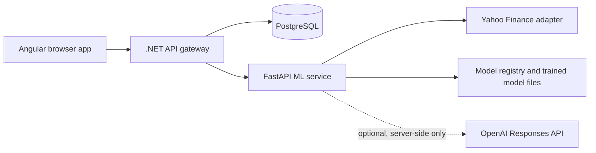

# Project Overview

StockAnalyzer is an educational stock research application for exploring listed equities by ticker, with a strong focus on transparent predictions, delayed market data, model accountability, and beginner-friendly explanations. It is not financial advice and must present predictions as educational estimates only.

## Product Scope

- Search stocks by ticker or company name.
- View historical prices, technical indicators, quote context, news, and market overview.
- Generate rule-based and Random Forest next-trading-day directional predictions.
- Persist prediction history, model metrics, workspace data, affiliate click events, users, and AI explanation metadata.
- Offer optional grounded AI explanations through the Python ML service only.
- Support guest workspaces first, with optional account signup/login and workspace claiming.

## Technology Stack

| Layer | Technology | Primary path |
| --- | --- | --- |
| Frontend | Angular 20, standalone components, signals, Chart.js | `frontend/` |
| API gateway | ASP.NET Core 9 Web API, Identity, JWT, EF Core | `backend/` |
| Domain/application | C# clean-ish layered services and abstractions | `backend/StockAnalyzer.*` |
| ML service | FastAPI, yfinance, pandas/scikit-learn, OpenAI SDK | `ml-service/` |
| Database | PostgreSQL 17, EF Core migrations | `backend/StockAnalyzer.Infrastructure/Persistence/` |
| Local orchestration | Docker Compose | `docker-compose.yml` |
| Production | Vercel, Render, Neon | `render.yaml`, `frontend/vercel.json` |

## Runtime Topology

## Documentation Map

- Business behavior: [01_Business_Domain.md](01_Business_Domain.md)
- Monetization roadmap: [15_Business_Monetization_Roadmap.md](15_Business_Monetization_Roadmap.md)
- Architecture: [02_System_Architecture.md](02_System_Architecture.md)
- APIs: [05_API_Documentation.md](05_API_Documentation.md)
- Database: [06_Database_Design.md](06_Database_Design.md)
- Feature guides: [Features/](Features/)
- AI assistant guardrails: [14_AI_Assistant_Instructions.md](14_AI_Assistant_Instructions.md)
