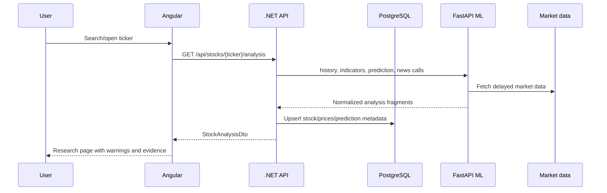
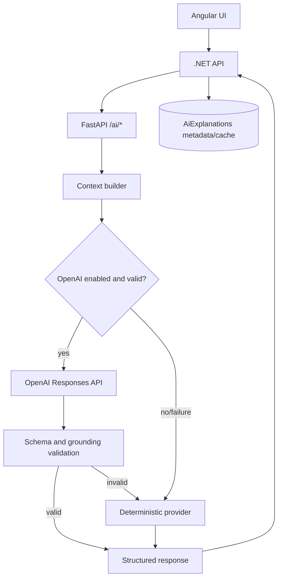

# System Architecture

StockAnalyzer uses a browser-to-gateway-to-ML architecture. The .NET API owns HTTP contracts, authentication, persistence, CORS, error shape, and correlation IDs. FastAPI owns market-data fetching, technical calculations, model training/inference, news labeling, and all OpenAI calls.

## Layers

| Layer | Responsibility |
| --- | --- |
| Angular | Navigation, forms, visualizations, browser-local state, typed API calls. |
| .NET API | Public API, auth, orchestration, DTO mapping, validation, error handling, persistence. |
| Application | Business workflows and service interfaces. |
| Domain | Entities and value objects such as `StockTicker`, `Prediction`, `GuestWorkspace`. |
| Infrastructure | EF Core, repositories, typed FastAPI client, provider metadata. |
| FastAPI ML | Market data, indicators, predictions, model registry, training jobs, AI generation. |
| PostgreSQL | Durable stock, prediction, workspace, identity, affiliate, and AI metadata. |

## Request Flow

## AI Boundary

Critical rule: do not move OpenAI calls into Angular or .NET.

## Error And Observability

- .NET middleware returns `application/problem+json` with `correlationId`.
- FastAPI middleware returns generic 500 payloads and attaches `X-Correlation-ID`.
- External service errors are mapped by .NET to 502/504 style failures through `ExternalServiceException`.
- Swagger is available for .NET and FastAPI in local development.

## Extension Points

- Replace Yahoo Finance through the ML market-data provider boundary.
- Add new public APIs through a controller, application abstraction/service, DTO, infrastructure implementation, and Angular service method.
- Add persisted entities through domain entity, EF configuration, repository, migration, and tests.
- Add new AI output only through FastAPI schemas/providers and .NET gateway DTOs.
