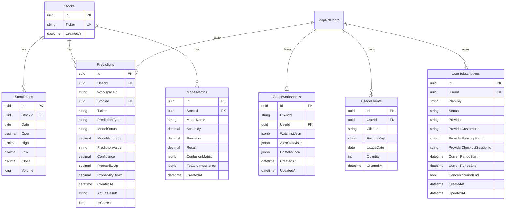

# Database Design

PostgreSQL is the durable store for identities, stocks, predictions, model metrics, guest workspaces, affiliate clicks, subscriptions, monetization usage, and AI explanation metadata. EF Core mappings live in `backend/StockAnalyzer.Infrastructure/Persistence/Configurations/`.

## Entity Relationship Overview

## Application Tables

| Table | Purpose | Key indexes/constraints |
| --- | --- | --- |
| `Stocks` | One row per normalized ticker. | Unique `Ticker`. |
| `StockPrices` | Historical daily OHLCV snapshots. | Unique `(StockId, Date)`. |
| `Predictions` | Prediction audit trail and evaluated outcome. | `(StockId, CreatedAt)`, `(UserId, WorkspaceId, CreatedAt)`. |
| `ModelMetrics` | Persisted model performance metadata. | `(StockId, CreatedAt)`. |
| `AiExplanations` | Cached/generated AI explanation metadata and JSON response. | `(Ticker, InputHash, Model, PromptVersion)`, `ExpiresAt`. |
| `GuestWorkspaces` | Browser/user workspace data as JSONB. | `ClientId`, unique `UserId`. |
| `AffiliateClicks` | Broker click events. | `(Broker, ClickedAt)`. |
| `UsageEvents` | Daily monetized feature usage for anonymous workspaces and signed-in users. | `(ClientId, FeatureKey, UsageDate)`, `(UserId, FeatureKey, UsageDate)`. |
| `UserSubscriptions` | Payment-provider subscription state used for paid plan resolution. | `UserId`, `ProviderCheckoutSessionId`. |
| `AspNet*` | ASP.NET Core Identity users, roles, claims, logins, tokens. | Identity defaults plus configured user fields. |

## JSONB Columns

- `GuestWorkspaces.WatchlistJson`: array of `WorkspaceWatchlistItemDto`.
- `GuestWorkspaces.AlertStateJson`: `WorkspaceAlertStateDto` with rules and notifications.
- `GuestWorkspaces.PortfolioJson`: array of `PortfolioHoldingDto`.
- `ModelMetrics.ConfusionMatrix` and `FeatureImportance`: ML metrics payload.
- `AiExplanations.ExplanationJson`: structured AI output returned by FastAPI.

## Migration Policy

- Add migrations under `backend/StockAnalyzer.Infrastructure/Persistence/Migrations/`.
- Keep entity shape, configuration, DTOs, repositories, and tests in sync.
- The API runs migrations at startup through `MigrateDatabaseAsync()`.
- Production Neon URLs are converted into Npgsql connection strings with SSL verification.
