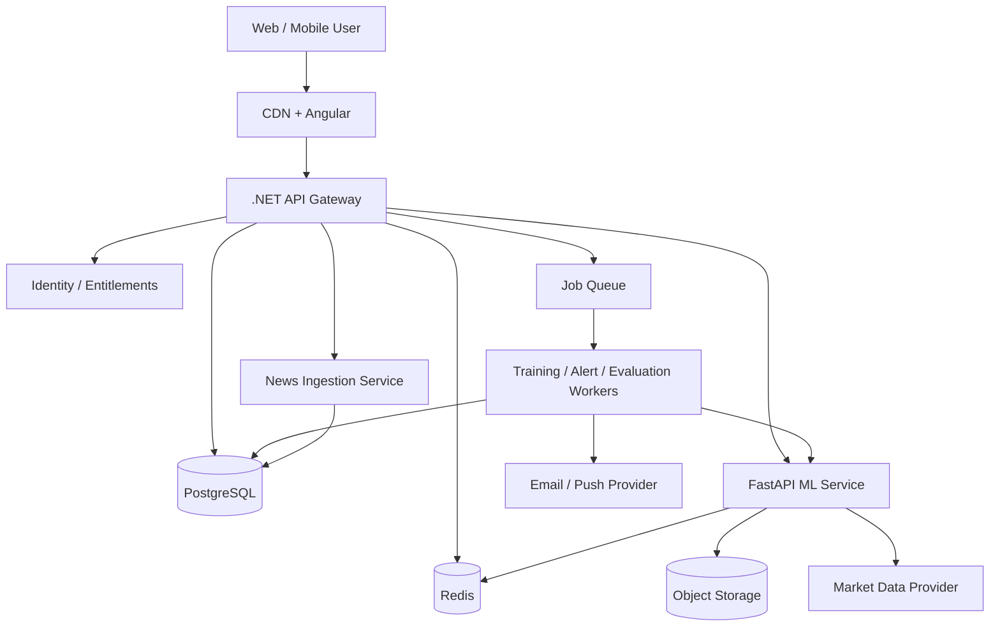

# StockAnalyzer Product Redesign Specification

**Document type:** Product vision, UX specification, SaaS architecture, and implementation blueprint  
**Primary audience:** Product managers, UX/UI designers, frontend engineers, backend engineers, ML engineers, QA engineers, and AI coding tools  
**Product category:** Explainable AI stock research and education platform  
**Status:** Proposed redesign  

> StockAnalyzer is an educational research product. It must never present a prediction as certainty or personalized financial advice.

---

# 1. Product Vision

## 1.1 What The Product Is

StockAnalyzer is an explainable AI stock research assistant that combines market data, technical analysis, model-based directional estimates, news context, risk indicators, and learning content in one understandable workspace.

The product answers five practical questions:

1. What is happening with this stock now?
2. Which signals support or oppose the current trend?
3. What does the model estimate for the next trading day?
4. How reliable is that estimate, and what could invalidate it?
5. How has the stock and the model behaved over time?

The directional model remains useful, but it is not the product's sole value. The central experience is evidence-based research: users see the signal, supporting evidence, conflicting evidence, risk, historical model quality, and plain-language education.

## 1.2 Problem It Solves

Retail investors currently move between charting tools, news sites, indicator tutorials, social media, spreadsheets, and prediction websites. These tools often create three problems:

- Too much information without prioritization.
- Predictions without transparent reasoning or reliability context.
- Interfaces designed for experienced traders rather than learners.

StockAnalyzer turns fragmented data into a structured research brief. It lowers the cognitive burden without hiding uncertainty.

## 1.3 Why Users Would Use It

- One search produces a complete stock research summary.
- Explanations use plain language and define unfamiliar concepts inline.
- Signals are separated into supporting, conflicting, and neutral evidence.
- Risk is shown as prominently as direction.
- Every model is ticker-specific and exposes training date and performance.
- Users can save stocks, compare changes, review prior predictions, and learn from outcomes.
- The platform supports Indian and US Yahoo Finance tickers in one workflow.

## 1.4 Differentiation

Simple prediction sites usually emphasize a single UP/DOWN answer, hide methodology, and encourage false confidence. StockAnalyzer should differentiate through:

| Typical prediction site | Redesigned StockAnalyzer |
| --- | --- |
| One opaque forecast | Evidence-backed research brief |
| Confidence presented as certainty | Confidence plus risk and model reliability |
| Only supporting signals | Supporting and conflicting signals |
| Generic model | Per-ticker model and metadata |
| No learning context | Embedded lessons and definitions |
| No outcome accountability | Prediction history and evaluated results |
| Advice-like language | Educational, neutral, non-prescriptive language |

## 1.5 Product Principles

1. **Explain before persuading.** Every conclusion must show evidence.
2. **Risk equals direction.** Risk information must be visually equal to prediction information.
3. **Uncertainty is a feature.** Low confidence and mixed signals should be explicit.
4. **Progressive disclosure.** Beginners see a summary; advanced users can inspect calculations.
5. **No fabricated insight.** Missing data produces an unavailable state, not invented analysis.
6. **Outcome accountability.** Predictions should later be evaluated against actual movement.
7. **Education in context.** Users learn indicators while using them.

---

# 2. Target Users

## 2.1 Beginner Investor: Ananya

**Profile:** 26, salaried professional, recently opened a brokerage account, follows finance creators, understands basic investing terms.

**Goals**

- Understand whether a stock currently looks strong, weak, or mixed.
- Learn indicators without reading technical textbooks.
- Build confidence before doing independent research.
- Avoid obvious high-risk decisions.

**Pain points**

- Charting platforms feel intimidating.
- Social-media opinions conflict and rarely show evidence.
- Terms such as RSI, MACD, support, and volatility are confusing.
- Confidence percentages appear more scientific than they really are.

**Features that matter**

- Beginner summary and glossary tooltips.
- Risk meter and conflicting-signals section.
- Simple chart annotations.
- Learning Center links from each indicator.
- Watchlist with daily summaries.

**Why StockAnalyzer**

It explains what the data means, not just what the model predicts.

## 2.2 Intermediate Trader: Rahul

**Profile:** 34, trades a few times per month, understands charts and common indicators, uses screeners and brokerage charts.

**Goals**

- Validate an existing thesis quickly.
- Compare momentum, trend, volume, and model output.
- Track whether a signal is strengthening or weakening.
- Review model performance before trusting an estimate.

**Pain points**

- Repeating the same checks across several tools.
- Indicators provide contradictory signals.
- Prediction products omit training quality and recency.

**Features that matter**

- Multi-timeframe indicators.
- Signal-strength scores.
- Support/resistance zones.
- Model metadata and confusion matrix.
- Comparison and watchlist sorting.

**Why StockAnalyzer**

It compresses a repeatable technical review into one transparent dashboard.

## 2.3 Swing Trader: Meera

**Profile:** 31, holds positions for several days to weeks and watches trend continuation, breakouts, volume, and catalysts.

**Goals**

- Identify trend alignment and potential breakout conditions.
- Find meaningful support, resistance, and invalidation levels.
- Monitor watchlist changes and alerts.
- Understand near-term news risk.

**Pain points**

- Missing a volume breakout or trend reversal.
- News arrives after technical conditions change.
- Too many alerts create noise.

**Features that matter**

- Trend state, momentum state, and volume confirmation.
- Price-level alerts and signal-change alerts.
- News sentiment and catalyst timeline.
- Daily watchlist digest.
- Prediction change history.

**Why StockAnalyzer**

It organizes price, volume, model, and catalyst evidence around a single research decision.

## 2.4 Long-Term Investor: Vikram

**Profile:** 43, invests monthly, holds for years, uses technical information mainly for context and entry discipline.

**Goals**

- Understand long-term price trend and drawdown risk.
- Avoid overreacting to one-day predictions.
- Track companies of interest in a watchlist.
- Eventually combine fundamentals with technical context.

**Pain points**

- Short-term trading language is irrelevant.
- Prediction tools encourage unnecessary action.
- Technical dashboards rarely explain long-term relevance.

**Features that matter**

- Long-term timeframe default.
- 52-week range, drawdown, volatility, and trend regime.
- Watchlist notes and thesis tracking.
- Clear distinction between short-term signal and long-term outlook.

**Why StockAnalyzer**

It can contextualize short-term movement without presenting it as an investment recommendation.

## 2.5 Stock Market Learner: Arjun

**Profile:** 20, student, uses paper trading and wants hands-on examples.

**Goals**

- Learn technical analysis through real stocks.
- Test understanding with quizzes.
- Compare predictions with actual outcomes.
- Understand model limitations and data leakage.

**Pain points**

- Educational material is disconnected from live examples.
- Many tutorials oversimplify indicators.
- ML content rarely explains evaluation properly.

**Features that matter**

- Interactive lessons and indicator sandboxes.
- “Explain this chart” mode.
- Prediction outcome review.
- Model training visualizer.
- Paper watchlist and learning streaks.

**Why StockAnalyzer**

It joins theory, live data, and historical evaluation in one educational environment.

## 2.6 Content Creator / YouTuber: Neha

**Profile:** 29, creates educational market content and needs clear visual summaries.

**Goals**

- Build a repeatable research workflow.
- Export clean charts and evidence summaries.
- Cite data timestamps and disclaimers.
- Compare several tickers for educational content.

**Pain points**

- Screenshots from professional terminals are visually dense.
- Rebuilding indicator explanations takes time.
- Audience members may mistake commentary for advice.

**Features that matter**

- Presentation mode and exportable research cards.
- Data-source and timestamp labels.
- Shareable read-only analysis links.
- Automatic educational disclaimer.
- Comparison view.

**Why StockAnalyzer**

It produces clear, accountable, audience-friendly research visuals without hiding uncertainty.

---

# 3. Product Positioning

## Recommended Positioning

**Explainable AI Stock Research Assistant**

Supporting statement:

> Understand the trend, evidence, risk, and model outlook for any supported stock in one research workspace.

## Why This Is Best

- **AI Stock Predictor** overpromises accuracy and attracts users seeking certainty.
- **AI Market Analyst** sounds authoritative and may imply professional advice.
- **AI Investment Learning Platform** is safe and valuable but undersells active research workflows.
- **Explainable AI Stock Research Assistant** communicates utility, transparency, and user control.

The assistant does not decide for the user. It gathers data, structures evidence, explains terminology, and records outcomes.

## Messaging Hierarchy

1. Primary: Research any stock with explainable signals and risk context.
2. Secondary: See a ticker-specific ML estimate and its historical performance.
3. Trust: Understand supporting and conflicting evidence.
4. Education: Learn every indicator in context.
5. Disclaimer: Educational research, not financial advice.

## Avoided Language

- “Guaranteed signal”
- “Winning stock”
- “Buy now” or “Sell now”
- “AI knows tomorrow's price”
- “72% chance of profit”

Preferred terms are “model estimate,” “directional signal,” “historical test accuracy,” “supporting evidence,” and “risk factors.”

---

# 4. Complete User Journey

```mermaid
flowchart LR
    A["Visit"] --> B["Search or explore market"]
    B --> C["Open stock overview"]
    C --> D["Read signal and risk summary"]
    D --> E["Inspect evidence and chart"]
    E --> F["Review model reliability"]
    F --> G["Save to watchlist"]
    G --> H["Configure alerts"]
    H --> I["Receive daily insight"]
    I --> J["Review prediction outcome"]
    J --> K["Learn and refine research process"]
```



## Step 1: Visit And Orient

- User sees a clear promise, universal ticker search, market status, and sample tickers.
- No account is required for the first analysis.
- The disclaimer is visible but does not dominate the hero.

## Step 2: Search

- Search supports ticker and company name.
- Autocomplete shows exchange, currency, asset type, and company name.
- Recent searches and popular stocks reduce typing.
- Invalid and unsupported symbols receive specific guidance.

## Step 3: Loading And Model Check

Progress is communicated as stages:

1. Validating ticker.
2. Loading market history.
3. Calculating technical indicators.
4. Checking ticker model.
5. Training a first-time model when required.
6. Building the research summary.

Users may leave the page during background training and receive an in-app notification when complete.

## Step 4: Stock Overview

The first viewport shows:

- Identity, exchange, price, daily movement, market timestamp.
- Directional estimate and confidence.
- Risk level.
- Three strongest supporting signals.
- Strongest conflicting signal.
- Model status and historical accuracy.

## Step 5: Understand Evidence

- User expands technical cards or switches to the Indicators tab.
- Hover/click definitions explain each indicator.
- Chart annotations connect explanation to price behavior.
- “Why does this matter?” links open short lessons.

## Step 6: Understand Risk

- Risk panel explains volatility, confidence, signal disagreement, news risk, and data quality.
- An invalidation section shows what change would weaken the current interpretation.
- Product never recommends position size or a trade.

## Step 7: Save And Personalize

- Anonymous users can save locally.
- Account users sync watchlists, notes, and alerts.
- User chooses watchlist, optional target note, and alert type.

## Step 8: Track

- Watchlist shows daily change, signal, confidence change, risk, latest alert, and news sentiment.
- Users sort by change, confidence, risk, or new insight.
- Daily digest summarizes only meaningful changes.

## Step 9: Review Outcomes

- Prediction History pairs each prior estimate with the actual next-day result.
- Users filter by ticker, model version, date, confidence, and correct/incorrect.
- An educational review explains why a prediction may have failed.

## Step 10: Learn

- Contextual lessons are recommended based on indicators viewed.
- Completion and quiz results are optional and non-gamified by default.
- Users can replay a historical signal without future data.

---

# 5. Complete UI/UX Design

## Global Navigation

Desktop navigation:

- Logo
- Search
- Market
- Watchlist
- History
- Learn
- Profile

Mobile navigation:

- Home
- Search
- Watchlist
- Insights
- More

Global requirements:

- Responsive from 360px to wide desktop.
- Keyboard navigable with visible focus.
- WCAG AA contrast.
- Skeleton loaders, explicit empty states, and retry actions.
- Every market value includes currency and data timestamp where ambiguity is possible.
- Color never communicates direction alone; use icon and text with green/red.

## Page Specifications

### Home Page

**Purpose:** Communicate value and begin analysis immediately.  
**Components:** Hero, universal search, market snapshot, popular stocks, feature proof, workflow, plans, FAQ, footer.  
**Data:** Index values, market state, popular tickers, sample insight cards.  
**Actions:** Search, open stock, create account, view demo, select plan.

### Stock Search Page

**Purpose:** Discover and validate an instrument.  
**Components:** Large autocomplete, filters, recent searches, sample ticker groups, search tips.  
**Data:** Symbol, company, exchange, currency, asset type, availability.  
**Actions:** Search, clear history, open stock, add directly to watchlist.

### Stock Analysis Dashboard

**Purpose:** Provide the complete research summary.  
**Components:** Header, summary cards, chart, evidence, risk, sentiment, levels, model status.  
**Data:** Quote, OHLCV, indicators, prediction, model metrics, levels, news.  
**Actions:** Change timeframe, save, alert, retrain, compare, export, learn.

### Prediction Page / Tab

**Purpose:** Explain the current model estimate and its limitations.  
**Components:** Direction card, confidence, probabilities, feature evidence, conflicting signals, model information, historical outcomes.  
**Data:** Prediction, probability distribution, feature values, model version, status, training date, accuracy.  
**Actions:** Retrain, inspect model performance, review similar historical cases.

### Technical Indicators Page / Tab

**Purpose:** Allow detailed technical inspection.  
**Components:** Indicator summary, grouped cards, interactive chart overlays, timeframe selector, definitions.  
**Data:** RSI, SMA, EMA, MACD, Bollinger Bands, returns, volume change, trend slope.  
**Actions:** Toggle overlays, compare periods, open lessons, export chart.

### News Sentiment Page / Tab

**Purpose:** Add catalyst and narrative context.  
**Components:** Sentiment gauge, article timeline, topic clusters, source list, summary, uncertainty notice.  
**Data:** Headline, publisher, published time, URL, sentiment, impact, related ticker.  
**Actions:** Filter, open source, mark irrelevant, view positive/negative evidence.

### Watchlist Page

**Purpose:** Monitor chosen stocks efficiently.  
**Components:** Watchlist selector, table/cards, insight digest, alert panel.  
**Data:** Price, daily change, signal, confidence delta, risk, sentiment, alert status.  
**Actions:** Add/remove/reorder, create alert, add note, compare, export.

### Prediction History Page

**Purpose:** Establish accountability and reveal patterns.  
**Components:** Summary metrics, filters, outcome table, accuracy trend chart, detail drawer.  
**Data:** Prediction time, expected direction, confidence, actual result, correctness, model version.  
**Actions:** Filter, inspect, export CSV, open stock, evaluate pending outcomes.

### Model Performance Page

**Purpose:** Explain model quality per ticker.  
**Components:** Ticker search, status, trained date, metrics, matrix, rows, feature importance, version history.  
**Data:** Accuracy, precision, recall, confusion matrix, split rows, feature importance, training date.  
**Actions:** Retrain, compare versions, open stock, view methodology.

### Learning Center Page

**Purpose:** Teach market and model concepts.  
**Components:** Learning paths, lesson cards, glossary, quizzes, live examples, progress.  
**Data:** Lesson metadata, completion, quiz results, related indicators.  
**Actions:** Start/resume, practice, bookmark, open current ticker example.

### User Profile Page

**Purpose:** Manage identity, preferences, alerts, and subscription.  
**Components:** Profile, market preferences, default timeframe, notification settings, plan, privacy controls.  
**Data:** User details, saved preferences, usage, billing state.  
**Actions:** Update, export/delete data, manage plan, manage sessions.

### Admin Dashboard

**Purpose:** Operate the SaaS safely.  
**Components:** Health, users, subscriptions, models, predictions, logs, feedback, ticker usage.  
**Data:** Operational and business metrics with audit events.  
**Actions:** Filter, inspect, retry jobs, disable ticker, moderate feedback, export.

---

# 6. Home Page Design

## Header

- Left: StockAnalyzer logo and product name.
- Center: Market, Watchlist, Learn, Pricing.
- Right: Sign in and “Analyze a stock” primary button.
- Sticky after scrolling; compact on mobile.

## Hero

Two-column desktop layout.

Left:

- Eyebrow: “Explainable AI stock research”
- Heading: “Understand the signal. See the evidence. Know the risk.”
- Supporting text: “Research supported Indian and US stocks with technical signals, ticker-specific model estimates, news context, and beginner-friendly explanations.”
- Search bar with company/ticker autocomplete.
- Secondary action: “Explore a sample analysis.”
- Trust line: “Educational research only. No buy or sell recommendations.”

Right:

- Interactive preview card for a sample ticker.
- Direction, confidence, risk, two supporting signals, one conflicting signal.
- Subtle chart background.

## Popular Stocks

- Horizontal cards grouped into India and US.
- Default examples: RELIANCE.NS, TCS.NS, INFY.NS, HDFCBANK.NS, AAPL, MSFT, TSLA, NVDA.
- Each card: price, daily change, signal badge, data timestamp.

## Market Overview

- Index cards: NIFTY 50, BANK NIFTY, SENSEX, S&P 500, NASDAQ.
- Market state: open, closed, pre-market, or delayed.
- Mini sparklines and daily change.
- Link to full Market Overview.

## Feature Story

Four steps:

1. Search any supported ticker.
2. Review trend, momentum, volume, and risk.
3. Understand the explainable model estimate.
4. Save and track changes over time.

## Feature Sections

- Explainable signals: supporting versus conflicting evidence.
- Ticker-specific ML: model status, date, and measured performance.
- Learn while researching: contextual definitions and lessons.
- Accountability: predictions matched to actual outcomes.

## Pricing Preview

Three cards with monthly/annual switch. The free plan remains prominent. Do not use artificial countdowns.

## FAQ

Questions:

- Is this financial advice?
- What does confidence mean?
- How is a model trained?
- Why can the model be wrong?
- Which tickers are supported?
- How current is the data?
- What happens when a model cannot be trained?

## Footer

- Product, Learn, Company, Legal, Status.
- Data-source attribution.
- Educational disclaimer.
- Version and system status link.

---

# 7. Stock Analysis Dashboard

## Desktop Layout

```text
+--------------------------------------------------------------------------+
| Stock identity / quote / timestamp                Save  Alert  Compare    |
+--------------------------------------------------------------------------+
| Prediction + confidence | Risk meter | Model status + measured accuracy  |
+--------------------------------------------------------------------------+
| Price chart with timeframe, overlays, volume, support/resistance          |
+--------------------------------------+-----------------------------------+
| Supporting and conflicting signals   | AI beginner explanation           |
+--------------------------------------+-----------------------------------+
| Technical signal grid                | News sentiment and catalysts      |
+--------------------------------------+-----------------------------------+
| Trend and volume analysis            | Model performance preview         |
+--------------------------------------------------------------------------+
```

## Stock Header

- Company name, ticker, exchange, currency.
- Current/last close price.
- Absolute and percentage daily change.
- Market state and last-updated timestamp.
- 52-week range indicator.
- Actions: Add to Watchlist, Alert, Compare, Share.

## Prediction Card

- Label: “Next trading-day model estimate.”
- Direction: Bullish/UP, Bearish/DOWN, or Mixed when confidence is low.
- Confidence: percentage plus Low/Moderate/High label.
- Probability bar with UP and DOWN.
- Model status badge: Existing, Newly Trained, or Rule-Based Fallback.
- Historical model accuracy nearby, visually distinct from confidence.
- Link: “How to interpret this.”

## Risk Meter

Risk score is composed from:

- Recent volatility.
- Signal disagreement.
- Model confidence.
- News-event intensity.
- Data completeness.
- Gap or unusual-volume conditions.

Display Low, Medium, High, or Data Limited. Show contributing factors rather than one unexplained number.

## Main Chart

- Timeframes: 1M, 3M, 6M, 1Y, 5Y, Max.
- Price mode: line or candlestick.
- Volume panel below price.
- Toggle overlays: SMA20, SMA50, EMA20, EMA50, Bollinger Bands.
- Support/resistance zones displayed as bands, not precise guaranteed prices.
- Event markers for high-impact news.
- Crosshair with OHLCV tooltip.
- Responsive simplified mobile chart.

## Technical Signals

Grouped by meaning:

- Momentum: RSI and MACD.
- Trend: EMA/SMA alignment and slope.
- Volatility: Bollinger width and realized volatility.
- Participation: volume and volume change.

Each card shows value, state, interpretation, direction contribution, freshness, and “Learn” link.

## Trend Analysis

- Short-term: price versus EMA20.
- Medium-term: EMA20 versus EMA50.
- Regime: bullish, bearish, sideways, or unstable.
- Trend strength and duration.
- Plain-language explanation.

## Volume Analysis

- Current volume versus 20-day average.
- Volume change.
- Whether volume confirms or weakens the current trend.
- Unusual volume marker.

## Support And Resistance

- Nearest support zone.
- Nearest resistance zone.
- Distance from current price.
- Method label and disclaimer that levels are estimates.

## News Sentiment

- Overall sentiment and confidence.
- Positive/negative article counts.
- Highest-impact catalyst.
- Latest three articles.
- Link to full sentiment tab.

## AI Explanation

Five blocks:

1. Current interpretation.
2. Supporting evidence.
3. Conflicting evidence.
4. What could change the interpretation.
5. Risk and educational disclaimer.

## Empty And Failure States

- Invalid ticker: explain accepted formats.
- No history: explain that Yahoo Finance returned no usable data.
- Insufficient model data: show rule fallback and data requirement.
- News unavailable: technical analysis remains available.
- Stale quote: show last successful timestamp.

---

# 8. AI Explanation System

## Explanation Contract

The explanation service receives structured facts and returns deterministic sections. It must not infer facts absent from the payload.

```json
{
  "direction": "UP",
  "confidence": 72,
  "risk_level": "MEDIUM",
  "supporting_signals": [],
  "conflicting_signals": [],
  "invalidation_conditions": [],
  "model_status": "existing_model",
  "model_accuracy": 0.56,
  "data_timestamp": "..."
}
```

## Language Rules

- Use “suggests,” “supports,” “indicates,” and “may.”
- Never use “will,” “guaranteed,” “safe,” or “should buy.”
- Explain confidence as model certainty for this classification, not probability of profit.
- Mention model accuracy separately.
- Keep the initial summary below 80 words; allow expansion.

## Example A: Bullish With Medium Risk

**Prediction:** Bullish / UP  
**Confidence:** 72%  
**Risk:** Medium

**Supporting signals**

- RSI is recovering from an oversold area, suggesting momentum has improved.
- MACD crossed above its signal line, which supports near-term bullish momentum.
- EMA20 is above EMA50, indicating the shorter trend is stronger than the medium trend.

**Conflicting signals**

- Volume is below its recent average, so the price move has limited participation.

**Simple explanation**

The technical picture currently leans upward, but low volume makes the signal less convincing. A move back below the EMA20 or a bearish MACD crossover would weaken this interpretation.

## Example B: Bearish With High Risk

**Prediction:** Bearish / DOWN  
**Confidence:** 64%  
**Risk:** High

**Supporting signals**

- EMA20 is below EMA50, indicating a bearish trend structure.
- MACD remains below its signal line.
- Selling volume is higher than the recent average.

**Conflicting signals**

- RSI is close to oversold, so a short-term rebound remains possible.

**Simple explanation**

Trend and volume currently favor weakness, but the stock is approaching an area where rebounds can occur. High volatility increases uncertainty.

## Example C: Mixed / Low Confidence

**Prediction:** Mixed, slight UP bias  
**Confidence:** 53%  
**Risk:** Medium

**Supporting signals**

- Price is above EMA20.

**Conflicting signals**

- MACD is bearish.
- RSI is neutral.
- Volume does not confirm the move.

**Simple explanation**

The evidence is divided and the model is close to an even probability split. This is better interpreted as uncertainty than as a strong directional signal.

## Example D: Rule-Based Fallback

**Prediction type:** Rule-Based Fallback  
**Reason:** The ticker did not have enough complete historical rows to train a model.

The result uses transparent RSI, EMA, MACD, and volume rules. Model accuracy is not shown because no ML model was used.

## Mandatory Footer

> Educational analysis only. This is not financial advice or a recommendation to buy or sell a security. Market conditions can change quickly, and historical model performance does not guarantee future results.

---

# 9. Watchlist System

## Core Objects

- User can own multiple watchlists.
- Watchlist has name, description, visibility, sort preference, and items.
- Watchlist item has ticker, added date, note, tags, alert configuration, and optional thesis.

## Add Flow

1. User selects “Add to Watchlist.”
2. Choose existing list or create new list.
3. Optional note and alert.
4. Confirmation toast with undo.

## Watchlist Screen

Columns/cards:

- Ticker and company.
- Price and daily change.
- Current signal and confidence.
- Confidence change since prior trading day.
- Risk level.
- News sentiment.
- Last meaningful insight.
- Alert state.

Mobile uses stacked cards with the same priority order.

## Alerts

Supported alerts:

- Price above/below threshold.
- Daily percentage move.
- Prediction direction changed.
- Confidence crossed threshold.
- Risk changed to High.
- Unusual volume.
- New high-impact news.

Alert controls must include frequency, quiet hours, channel, and cooldown. Duplicate alerts are grouped.

## Notifications

- In-app notification center.
- Email daily digest for Pro/Premium.
- Push notification in future mobile phase.
- Every notification states data timestamp and links to evidence.

## Empty State

“Your watchlist is your research queue. Add a stock to track signal, risk, and important changes.” Include sample ticker buttons.

---

# 10. Learning Center

## Information Architecture

Learning paths:

1. Stock market foundations.
2. Reading price and volume.
3. Trend indicators.
4. Momentum indicators.
5. Risk management.
6. Understanding ML predictions.

## Lesson Template

- 3-5 minute concept explanation.
- Visual example.
- Live ticker example.
- “Common mistake” callout.
- Three-question knowledge check.
- Related glossary entries.
- Continue button.

## Required Topics

### RSI

- Measures recent momentum on a 0-100 scale.
- Explain overbought/oversold as context, not automatic reversal.
- Interactive slider changes example price sequence.

### MACD

- Explain MACD line, signal line, crossover, and lag.
- Animate crossover on a simple chart.

### EMA

- Explain recency weighting and trend responsiveness.
- Compare EMA20 with EMA50.

### SMA

- Explain arithmetic average and smoothing.
- Compare SMA with raw price.

### Volume Analysis

- Explain participation and confirmation.
- Show high-volume breakout versus low-volume move.

### Risk Management

- Volatility, diversification, drawdown, uncertainty, and avoiding concentration.
- No personalized allocation or trade instructions.

## Contextual Learning

Every indicator card has:

- One-line definition.
- “Why it matters now.”
- Link to full lesson.
- Mark as understood/bookmark option.

---

# 11. News Sentiment Module

## Pipeline

1. Collect licensed or permitted headlines and metadata.
2. Normalize ticker/company references.
3. Deduplicate syndicated articles.
4. Classify relevance.
5. Score sentiment: positive, neutral, negative.
6. Estimate impact: low, medium, high.
7. Create a fact-constrained summary with source links.
8. Cache and timestamp results.

## Screen Design

Top summary:

- Sentiment gauge.
- Article count and lookback period.
- Confidence/data-coverage label.
- Highest-impact topic.

Topic chips:

- Earnings
- Guidance
- Regulation
- Product
- Management
- Macro
- Analyst commentary

Article card:

- Headline, publisher, timestamp.
- Sentiment badge and impact score.
- Two-sentence summary.
- “Why this may matter” educational note.
- Open original source.

## Safety And Quality

- Never summarize beyond available article facts.
- Clearly label stale or low-coverage sentiment.
- Sentiment does not directly equal price direction.
- Preserve source attribution and licensing requirements.

---

# 12. Market Overview Page

## Header

- Market session status and timestamp.
- Region switch: India / US.
- Refresh control and delayed-data label.

## Index Grid

India:

- NIFTY 50
- BANK NIFTY
- SENSEX

US expansion:

- S&P 500
- NASDAQ Composite
- Dow Jones

Each card shows value, daily change, day range, sparkline, and market state.

## Market Breadth

- Advancers versus decliners.
- New highs/lows where data is available.
- Overall market sentiment label based on transparent breadth rules.

## Movers

Three responsive tables:

- Top Gainers
- Top Losers
- Most Active

Columns: ticker, company, price, change, volume, relative volume, signal, risk. Clicking a row opens Stock Analysis.

## Insight Strip

Examples:

- “Banking stocks show above-average volume.”
- “Market breadth is weak despite a positive index close.”

These must be rule-based and cite the underlying aggregate.

---

# 13. Pricing Strategy

Pricing should be validated with users before final amounts. Start with transparent feature tiers and no performance claims.

## Free

**Ideal for:** Learners and occasional investors.

- 10 stock analyses per day.
- Automatic ticker model creation.
- Core indicators and prediction explanation.
- One watchlist, up to 10 stocks.
- Limited prediction history.
- Learning Center foundations.
- Delayed or standard available market data.

## Pro

**Ideal for:** Active investors and swing traders.

- Higher/fair-use analysis limits.
- Five watchlists, up to 100 stocks.
- Alerts and daily digest.
- Full model metrics and history.
- News sentiment.
- Comparison view.
- CSV and image exports.
- Faster training queue.

## Premium

**Ideal for:** Power users, educators, and content creators.

- Larger watchlists and alert quotas.
- Advanced multi-timeframe analysis.
- Presentation mode and branded exports.
- Portfolio tracking when launched.
- AI research assistant when launched.
- Priority processing and support.

## Monetization Guardrails

- Do not sell “more accurate predictions.”
- Paid plans sell workflow, scale, alerts, exports, and deeper context.
- Show usage clearly before limits are reached.
- Provide straightforward cancellation and data export.

---

# 14. Admin Dashboard

## Roles

- Support Agent: users and feedback.
- Analyst/ML Operator: models and ticker health.
- Administrator: subscriptions and configuration.
- Super Admin: role assignment and destructive operations.

All sensitive actions require audit logging.

## Overview

- Active users, analyses, training jobs, fallback rate.
- API latency and error rate.
- Data-provider status.
- Subscription metrics.
- Alert-delivery health.

## Users

- Search, plan, signup date, activity, status.
- View usage and support history.
- Suspend/reactivate with reason.
- Never expose passwords or raw secrets.

## Predictions

- Volume by date/ticker/status.
- Direction distribution and confidence distribution.
- Evaluated accuracy and pending outcomes.
- Fallback reasons.

## Model Performance

- Model count, stale models, training failures.
- Accuracy/precision/recall distribution.
- Ticker version history.
- Retrain/deactivate controls.
- Data rows and last training duration.

## Logs

- Search by correlation ID, service, severity, route, ticker.
- PII redaction.
- Retention rules and export permissions.

## Feedback

- Category, severity, page, browser, user message.
- Status workflow: New, Triaged, Planned, Resolved.
- Link feedback to product issue.

## Subscriptions

- Plan counts, trials, upgrades, cancellations, payment failures.
- Entitlement inspection.
- Refund/credit actions require elevated permissions.

## Ticker Statistics

- Searches, successful analyses, model availability, fallback rate.
- Provider errors and average training time.
- Ability to temporarily disable problematic symbols with a user-facing reason.

---

# 15. Technical Architecture

## Recommended Stack

### Frontend

- Angular with standalone components and signals.
- Angular Router with feature-level lazy loading.
- RxJS for request orchestration.
- Chart.js initially; consider a financial chart library for production candlesticks after licensing review.
- Design tokens and reusable component library.
- Typed API client generated from OpenAPI where practical.

### Backend Gateway

- .NET Web API using Clean Architecture.
- ASP.NET Core authentication/authorization.
- EF Core and PostgreSQL.
- Typed `HttpClient` with resilience, timeouts, cancellation, and correlation IDs.
- Background jobs for evaluation, alerts, digests, and retraining.

### ML Service

- FastAPI, pandas, scikit-learn.
- Separate modules for data ingestion, feature generation, training, registry, inference, and explanation facts.
- Versioned feature schema and model metadata.
- Job-based training endpoint for scale; synchronous training remains acceptable for the local MVP.

### Database

PostgreSQL domains:

- Identity and subscriptions.
- Instruments and quotes.
- Watchlists and alerts.
- Predictions and outcomes.
- Models, model versions, metrics, and training jobs.
- News metadata and sentiment.
- Learning content and progress.
- Audit logs and feedback.

### Caching

- Redis for quote/history caches, model-metadata cache, rate limits, sessions, and job state.
- Cache keys include ticker, interval, period, data version, and provider.
- Serve stale-but-labeled data during temporary provider failure where appropriate.

### Object Storage

- Store model binaries, generated datasets where permitted, chart exports, and large artifacts in S3-compatible object storage.
- PostgreSQL stores references and metadata, not large binaries.

### Messaging And Jobs

- MVP: Hangfire or Quartz.NET with PostgreSQL storage.
- Scale: cloud queue/service bus plus dedicated workers.
- Idempotent jobs with retry policy and dead-letter handling.

### Deployment

- Local: Docker Compose.
- Production: containerized services behind managed load balancer/API gateway.
- Managed PostgreSQL, Redis, and object storage.
- CDN for Angular assets.
- Separate development, staging, and production environments.
- Infrastructure as code.

## Scalable Component Diagram



## Core Data Contracts

### Instrument

- id, ticker, company_name, exchange, currency, asset_type, provider_symbol, active.

### Model Version

- id, instrument_id, model_name, feature_schema_version, artifact_uri, status, trained_at, train_rows, test_rows, accuracy, precision, recall, confusion_matrix, feature_importance.

### Prediction

- id, instrument_id, model_version_id nullable, prediction_type, direction, confidence, probability_up, probability_down, risk_level, reasons, data_timestamp, created_at, actual_result, is_correct.

### Analysis Snapshot

- quote, indicators, trend, volume, levels, sentiment, prediction, risk, explanation, freshness.

## API Surface

- `GET /api/search?q=`
- `GET /api/market/overview?region=`
- `GET /api/stocks/{ticker}/analysis?period=&interval=`
- `GET /api/stocks/{ticker}/history`
- `GET /api/stocks/{ticker}/indicators`
- `GET /api/stocks/{ticker}/news`
- `GET /api/predictions/{ticker}`
- `GET /api/models/{ticker}/metrics`
- `POST /api/models/{ticker}/train`
- `GET/POST/DELETE /api/watchlists`
- `POST /api/alerts`
- `GET /api/predictions/history`
- `GET /api/learning/lessons`
- `GET/PATCH /api/profile`

Use consistent Problem Details errors, pagination, UTC timestamps, idempotency keys for retriable writes, and API versioning.

## Security And FinTech Controls

- OIDC/OAuth authentication and MFA option.
- Role and entitlement authorization.
- Encrypt data in transit and at rest.
- Secret manager, never repository secrets.
- Rate limiting by user, IP, route, and plan.
- Input validation and ticker allowlisting through instrument lookup.
- Audit administrative and billing operations.
- Dependency, container, and secret scanning in CI.
- Backup, restore, and retention testing.
- Explicit data provenance and timestamps.
- Legal review for market-data and news licensing.

## Observability

- Structured logs with correlation, user, ticker, model version, and job ID where permitted.
- Metrics: latency, error rate, cache hit rate, provider failures, fallback rate, training duration.
- Distributed tracing between .NET, FastAPI, workers, and providers.
- Alerts based on service objectives, not individual transient failures.

---

# 16. Future Roadmap

## Phase 1: Redesigned MVP

- New positioning and visual system.
- Unified Stock Analysis Dashboard.
- Improved explanation and risk model.
- Per-ticker model status and metrics.
- Responsive/accessibility baseline.
- Instrumented analytics and feedback.

**Exit criteria:** Users can complete a stock research flow and correctly explain confidence versus model accuracy in usability testing.

## Phase 2: Multi-Stock Support

- Robust company/ticker search.
- India and US instrument catalog.
- Comparison view.
- Background training jobs and model versioning.
- Market Overview.

## Phase 3: Watchlists

- Accounts and synced watchlists.
- Notes, tags, and daily changes.
- Signal and price alerts.
- Daily digest.

## Phase 4: News Sentiment

- Licensed ingestion and deduplication.
- Relevance, sentiment, impact, and topic classification.
- Source-grounded summaries.
- News-event chart markers.

## Phase 5: Portfolio Tracking

- Manual holdings import first.
- Portfolio exposure, concentration, performance, and risk.
- No brokerage execution in the initial version.
- Strict privacy and deletion controls.

## Phase 6: AI Research Assistant

- Conversational questions over structured StockAnalyzer data.
- Source citations and timestamped evidence.
- No unsupported recommendations.
- User-controlled memory for watchlists and preferences.

## Phase 7: Mobile App

- Flutter or native mobile evaluation based on team skills.
- Watchlist, alerts, concise stock analysis, and learning.
- Push notifications with alert controls.
- Offline access to saved educational content.

---

# 17. Final Product Specification

## 17.1 Product Scope

The rebuilt product must allow a user to discover a supported stock, receive an explainable analysis, inspect technical and model evidence, understand risk, save the stock, monitor changes, review historical outcomes, and learn the concepts involved.

## 17.2 Functional Requirements

### Search

- Search by ticker or company name.
- Display exchange and currency.
- Validate before navigation.
- Preserve recent searches with privacy controls.

### Analysis

- Return quote, history, indicators, prediction, model metadata, risk, explanation, and freshness.
- Support at least 1M, 3M, 6M, 1Y, and 5Y views.
- Distinguish ML and rule-based fallback visibly.
- Display missing modules independently instead of failing the whole page.

### Prediction

- UP/DOWN probabilities sum to approximately 1.
- Confidence is 0-100 and labeled.
- Model accuracy is separate.
- Supporting and conflicting evidence are separate arrays.
- Include educational warning.

### Models

- One active model version per ticker at a time.
- Store artifact, metadata, feature schema, training rows, testing rows, trained date, metrics, and confusion matrix.
- Manual retraining creates a new version and does not destroy audit history.
- Promote new version only after successful validation and artifact write.

### Watchlists

- Create, rename, delete, and reorder watchlists.
- Add/remove stocks idempotently.
- Configure alert preferences.
- Show daily signal/risk changes.

### History

- Store every prediction snapshot used by a user-facing response.
- Evaluate against the next eligible trading day.
- Support filters and export.

### Learning

- Versioned lessons and glossary.
- Context links from indicators.
- Optional user progress.

### Admin

- Role-protected operational dashboards.
- Audit all privileged actions.
- Inspect failed jobs without exposing secrets.

## 17.3 Non-Functional Requirements

- Initial cached analysis response under 2 seconds at p95; uncached provider calls and training use explicit progress.
- Core pages meet WCAG 2.1 AA.
- Mobile-first responsive behavior.
- 99.9% target availability after production hardening.
- No secret or model binary committed to Git.
- API operations are observable with correlation IDs.
- Background jobs are idempotent.
- Database migrations are backward-compatible where practical.
- User data export and deletion are supported before public paid launch.

## 17.4 UX Acceptance Criteria

- A first-time user can find a ticker and understand the main conclusion without knowing RSI or MACD.
- Confidence, risk, and historical model accuracy cannot be visually confused.
- Fallback results are never styled as ML output.
- Supporting and conflicting evidence are both visible in the first two viewport heights.
- All loading operations communicate the current stage.
- Every empty state explains what happened and offers a next action.

## 17.5 Analytics Events

- `home_search_started`
- `ticker_search_completed`
- `analysis_loaded`
- `analysis_module_failed`
- `explanation_expanded`
- `indicator_lesson_opened`
- `watchlist_item_added`
- `alert_created`
- `model_retrain_started/completed/failed`
- `prediction_history_viewed`
- `plan_viewed`

Do not place ticker searches or personal notes into third-party analytics without an approved privacy policy and data controls.

## 17.6 Design System Deliverables

- Color, typography, spacing, elevation, radius, iconography, and chart tokens.
- Components: buttons, inputs, autocomplete, tabs, badges, cards, metrics, probability bars, risk meter, chart controls, tables, drawers, toasts, skeletons, empty/error states.
- Responsive Figma designs for every page in Section 5.
- Interaction prototypes for search, first-time training, watchlist, alert creation, and retraining.
- Accessibility annotations and content guidelines.

## 17.7 Engineering Workstreams

1. Design system and application shell.
2. Instrument catalog and search.
3. Unified analysis aggregation API.
4. Model version registry and asynchronous training.
5. Explanation and risk engines.
6. Watchlists, accounts, and entitlements.
7. Prediction evaluation and model performance.
8. News ingestion and sentiment.
9. Learning content platform.
10. Admin, observability, security, and billing.

## 17.8 Definition Of Done

A feature is done only when:

- Product acceptance criteria pass.
- Responsive and accessibility behavior is tested.
- Loading, empty, partial, stale, unauthorized, and error states exist.
- API contract and validation are documented.
- Unit, integration, and critical end-to-end tests pass.
- Logs and metrics are present without leaking sensitive data.
- Educational disclaimer and data timestamp appear where required.
- Documentation and screenshots are updated.

## 17.9 Recommended Build Order For AI Coding Tools

1. Read this document and the current repository README.
2. Produce an implementation plan by bounded vertical slices.
3. Build the design tokens and reusable components first.
4. Introduce the unified analysis API without removing current endpoints.
5. Rebuild Stock Analysis as the reference vertical slice.
6. Add model performance and prediction history.
7. Add authentication and watchlists.
8. Add market overview and news behind feature flags.
9. Add billing only after entitlements are stable.
10. Preserve migrations, tests, backward compatibility, and educational safeguards at every step.

---

## Product North Star

**Weekly Explained Analyses:** the number of distinct users who complete a stock analysis and engage with at least one evidence, risk, or learning detail.

This metric rewards understanding rather than clicks, predictions generated, or trading activity.

## Supporting Metrics

- Search-to-analysis completion.
- Explanation expansion rate.
- Watchlist retention.
- Prediction outcome review rate.
- Learning lesson completion.
- Percentage of fallback results understood without support contact.
- Model training success and data-provider reliability.

## Final Product Promise

> StockAnalyzer helps people research stocks with clearer evidence, visible uncertainty, and practical education. It does not replace judgment; it improves the quality of the user's questions.
